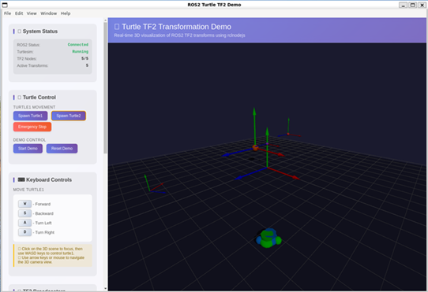
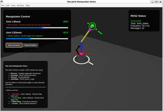

# rclnodejs - The ROS 2 Client Library for JavaScript

[](https://www.npmjs.com/package/rclnodejs) [](https://coveralls.io/github/RobotWebTools/rclnodejs?branch=develop) [](https://www.npmjs.com/package/rclnodejs) [](https://github.com/RobotWebTools/rclnodejs/blob/develop/LICENSE) [](https://nodejs.org/en/download/releases/) [](https://www.npmjs.com/package/rclnodejs) [](https://github.com/prettier/prettier)

|           **ROS Distro\***           |                                                                                                                                                                                                                                                                                                                                                          **Status**                                                                                                                                                                                                                                                                                                                                                          |
| :----------------------------------: | :--------------------------------------------------------------------------------------------------------------------------------------------------------------------------------------------------------------------------------------------------------------------------------------------------------------------------------------------------------------------------------------------------------------------------------------------------------------------------------------------------------------------------------------------------------------------------------------------------------------------------------------------------------------------------------------------------------------------------: |
| Rolling<br>Kilted<br>Jazzy<br>Humble | [](https://github.com/RobotWebTools/rclnodejs/actions/workflows/linux-x64-push-test.yml?query=branch%3Adevelop)<br>[](https://github.com/RobotWebTools/rclnodejs/actions/workflows/linux-arm64-push-test.yml?query=branch%3Adevelop)<br>[](https://github.com/RobotWebTools/rclnodejs/actions/workflows/windows-push-test.yml?query=branch%3Adevelop) |

> **Note:** rclnodejs development and maintenance is limited to the ROS 2 LTS releases and the Rolling development branch

**rclnodejs** is a Node.js client library for [ROS 2](https://www.ros.org/) that provides comprehensive JavaScript and TypeScript APIs for developing ROS 2 solutions.

```javascript
const rclnodejs = require('rclnodejs');
rclnodejs.init().then(() => {
  const node = new rclnodejs.Node('publisher_example_node');
  const publisher = node.createPublisher('std_msgs/msg/String', 'topic');
  publisher.publish(`Hello ROS 2 from rclnodejs`);
  node.spin();
});
```

## Documentation

- [Installation](#installation)
- [rclnodejs-cli](#rclnodejs-cli)
- [API Documentation](#api-documentation)
- [Tutorials](./tutorials/)
- [Electron-based Visualization](#electron-based-visualization)
- [Using TypeScript](#using-rclnodejs-with-typescript)
- [Observable Subscriptions](#observable-subscriptions)
- [ROS2 Interface Message Generation](#ros2-interface-message-generation)
- [Performance Benchmarks](#performance-benchmarks)
- [Efficient Usage Tips](./docs/EFFICIENCY.md)
- [FAQ and Known Issues](./docs/FAQ.md)
- [Building from Scratch](./docs/BUILDING.md)
- [Contributing](./docs/CONTRIBUTING.md)

## Installation

### Prerequisites

- [Node.js](https://nodejs.org/en/) version >= 16.13.0
- [ROS 2 SDK](https://docs.ros.org/en/jazzy/Installation.html) - **Don't forget to [source the setup file](https://docs.ros.org/en/jazzy/Tutorials/Beginner-CLI-Tools/Configuring-ROS2-Environment.html#source-the-setup-files)**

### Install rclnodejs

```bash
npm i rclnodejs
```

> **Note:** To install rclnodejs from GitHub: add `"rclnodejs":"RobotWebTools/rclnodejs#<branch>"` to your `package.json` dependency section.

> **Docker:** For containerized development, see the included [Dockerfile](./Dockerfile) for building and testing with different ROS distributions and Node.js versions.

See the [features](./docs/FEATURES.md) and try the [examples](https://github.com/RobotWebTools/rclnodejs/tree/develop/example) to get started.

### Prebuilt Binaries

rclnodejs ships with prebuilt native binaries for common Linux configurations since `v1.5.2`, eliminating the need for compilation during installation. This significantly speeds up installation and reduces dependencies.

**Supported Platforms:**

- **Ubuntu 22.04 (Jammy)** - ROS 2 Humble
- **Ubuntu 24.04 (Noble)** - ROS 2 Jazzy, Kilted
- **Architectures:** x64, arm64
- **Node.js:** >= 16.20.2 (N-API compatible)

**Force Building from Source:**

If you need to build from source even when a prebuilt binary is available, set the environment variable:

```bash
export RCLNODEJS_FORCE_BUILD=1
npm install rclnodejs
```

## rclnodejs-cli

[rclnodejs-cli](https://github.com/RobotWebTools/rclnodejs-cli/) is a companion project we recently launched to provide a commandline interface to a set of developer tools for working with this `rclnodejs`. You may find `rclnodejs-cli` particularly useful if you plan to create ROS 2 node(s) and launch files for working with multiple node orchestrations.

```bash
Usage: rclnodejs [command] [options]

Options:
  -h, --help                               display help for command

Commands:
  create-package [options] <package-name>  Create a ROS2 package for Nodejs development.
  generate-ros-messages                    Generate JavaScript code from ROS2 IDL interfaces
  help [command]                           display help for command
```

## API Documentation

API documentation is available [online](https://robotwebtools.github.io/rclnodejs/docs/index.html) or generate locally with `npm run docs`.

## Electron-based Visualization

Create rich, interactive desktop applications using Electron and web technologies like Three.js. Demos leverage **Electron Forge** for easy packaging on Windows, macOS, and Linux.

|                       Demo                        |                                                              Description                                                              |                            Screenshot                            |
| :-----------------------------------------------: | :-----------------------------------------------------------------------------------------------------------------------------------: | :--------------------------------------------------------------: |
|  **🐢 [turtle_tf2](./electron_demo/turtle_tf2)**  |  Real-time coordinate frame visualization with turtle control. Features TF2 transforms, keyboard control, and dynamic frame updates.  |     |
| **🦾 [manipulator](./electron_demo/manipulator)** | Interactive two-joint robotic arm simulation. Features 3D joint visualization, manual/automatic control, and visual movement markers. |  |

Explore more examples in [electron_demo](https://github.com/RobotWebTools/rclnodejs/tree/develop/electron_demo).

## Using rclnodejs with TypeScript

TypeScript declaration files are included in the `types/` folder. Configure your `tsconfig.json`:

```jsonc
{
  "compilerOptions": {
    "module": "commonjs",
    "moduleResolution": "node",
    "target": "es2020",
  },
}
```

TypeScript example:

```typescript
import * as rclnodejs from 'rclnodejs';
rclnodejs.init().then(() => {
  const node = new rclnodejs.Node('publisher_example_node');
  const publisher = node.createPublisher('std_msgs/msg/String', 'topic');
  publisher.publish(`Hello ROS 2 from rclnodejs`);
  node.spin();
});
```

See [TypeScript demos](https://github.com/RobotWebTools/rclnodejs/tree/develop/ts_demo) for more examples.

## Observable Subscriptions

rclnodejs supports [RxJS](https://rxjs.dev/) Observable subscriptions for reactive programming with ROS 2 messages. Use operators like `throttleTime()`, `debounceTime()`, `map()`, and `combineLatest()` to build declarative message processing pipelines.

```javascript
const { throttleTime, map } = require('rxjs');

const obsSub = node.createObservableSubscription(
  'sensor_msgs/msg/LaserScan',
  '/scan'
);
obsSub.observable
  .pipe(
    throttleTime(200),
    map((msg) => msg.ranges)
  )
  .subscribe((ranges) => console.log('Ranges:', ranges.length));
```

See the [Observable Subscriptions Tutorial](./tutorials/observable-subscriptions.md) for more details.

## ROS2 Interface Message Generation

ROS client libraries convert IDL message descriptions into target language source code. rclnodejs provides the `generate-ros-messages` script to generate JavaScript message interface files and TypeScript declarations.

**Example usage:**

```javascript
import * as rclnodejs from 'rclnodejs';
let stringMsgObject = rclnodejs.createMessageObject('std_msgs/msg/String');
stringMsgObject.data = 'hello world';
```

### Running Message Generation

Run the message generation script when new ROS packages are installed:

```bash
npx generate-ros-messages
```

Generated files are located at `<yourproject>/node_modules/rclnodejs/generated/`.

> **Note:** This step is not needed for rclnodejs > 1.5.0

### IDL Message Generation

In addition to the standard ROS2 message generation (`.msg`, `.srv`, and `.action`), rclnodejs provides advanced support for generating JavaScript message files directly from IDL (Interface Definition Language) files. This feature is particularly useful when working with custom IDL files or when you need more control over the message generation process.

To generate messages from IDL files, use the `generate-messages-idl` npm script:

```bash
npm run generate-messages-idl
```

## Performance Benchmarks

Benchmark results for 1000 iterations with 1024KB messages (Ubuntu 24.04.3 WSL2, i7-1185G7):

| Library                 | Topic (ms) | Service (ms) |
| ----------------------- | ---------- | ------------ |
| **rclcpp (C++)**        | 168        | 627          |
| **rclnodejs (Node.js)** | 744        | 927          |
| **rclpy (Python)**      | 1,618      | 15,380       |

See [benchmark/README.md](benchmark/README.md) for details.

## Contributing

Please read the [Contributing Guide](./docs/CONTRIBUTING.md) before making a pull request.

Thanks to all [contributors](CONTRIBUTORS.md)!

## License

This project abides by the [Apache License 2.0](https://github.com/RobotWebTools/rclnodejs/blob/develop/LICENSE).
