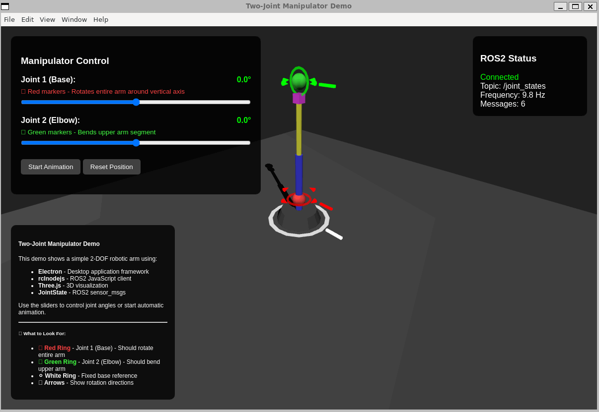

# Two-Joint Manipulator Demo

An interactive Electron application demonstrating a two-joint robotic manipulator visualization using rclnodejs and Three.js.



## 🚀 Features

- **Real-time 3D Visualization**: Interactive two-joint robotic arm with Three.js
- **ROS2 Integration**: Publishes and subscribes to `sensor_msgs/msg/JointState` topics
- **Interactive Control**: Manual joint control with sliders
- **Automatic Animation**: Smooth sinusoidal motion patterns
- **Live Feedback**: Real-time joint position display and ROS2 message frequency
- **Visual Movement Markers**: Color-coded rings, arrows, and labels to identify joint movements
- **Modern UI**: Clean, responsive interface with 3D orbit controls

## 📋 Prerequisites

- **Node.js** (>= 20.20.2) - JavaScript runtime
- **ROS 2** (Humble, Jazzy, Kilted, Lyrical, or Rolling) - Robot Operating System 2
- **rclnodejs compatible environment** - Linux recommended (tested on Ubuntu/WSL)

## 🛠️ Installation

1. **Navigate to the demo directory**:

   ```bash
   cd rclnodejs/demo/electron/manipulator
   ```

2. **Install dependencies**:

   ```bash
   npm install
   ```

3. **Source your ROS 2 environment** (required so the matching prebuilt binary is selected):

   ```bash
   source /opt/ros/$ROS_DISTRO/setup.bash  # or your ROS 2 installation path
   ```

   rclnodejs ships prebuilt native binaries for Electron, so no compilation is needed.
   The binary is selected at runtime from `ROS_DISTRO`, the Linux distro codename, and
   the CPU architecture, so `ROS_DISTRO` must be set before launching the app. If no
   matching prebuilt binary is available for your platform, rclnodejs falls back to
   building from source.

   > Note: do not run `electron-rebuild` against rclnodejs — it recompiles the addon
   > from source and bypasses the prebuilt binary. The Electron Forge `rebuildConfig`
   > in `package.json` already excludes `rclnodejs` from the automatic rebuild step.

## 📜 Available Scripts

- **`npm start`** - Launch the application in development mode
- **`npm run package`** - Package the application into a standalone executable folder
- **`npm run make`** - Create platform-specific installers (requires system tools like `zip`, `dpkg`)

## 🚀 Quick Start

### Option 1: Simple Demo (Works Everywhere)

```bash
npm start
```

- ✅ **No ROS2 topic publishing required**
- ✅ **Pure visualization and manual control**
- ⚠️ ROS 2 must still be sourced so the prebuilt native binary is selected (otherwise rclnodejs builds from source)
- ⚠️ No ROS2 topic publishing (local mode only)

### Option 2: Manual ROS2 Setup (Recommended for ROS2 Integration)

1. **Source your ROS2 environment**:

   ```bash
   source /opt/ros/$ROS_DISTRO/setup.bash  # or your ROS2 installation path
   ```

2. **Run the demo**:
   ```bash
   npm start
   ```

- ✅ **Publishes to `/joint_states` topic**
- ✅ **Full ROS2 ecosystem integration**
- ✅ **Real-time ROS2 message monitoring**

## 🎮 Usage

### Interactive Controls

- **Joint Sliders**: Use the sliders in the control panel to manually adjust joint angles
  - **Joint 1 (Base)**: Rotates the entire arm around the vertical axis (±180°)
  - **Joint 2 (Elbow)**: Bends the upper arm segment (±135°)

- **Animation**: Click "Start Animation" for automatic smooth motion
- **Reset**: Click "Reset Position" to return to zero configuration

### 3D Visualization Controls

- **Orbit**: Click and drag to rotate the camera around the manipulator
- **Zoom**: Use mouse wheel to zoom in/out
- **View**: The manipulator is shown with color-coded components:
  - **Gray Base**: Fixed mounting base
  - **Red Joint 1**: Base rotation joint
  - **Blue Link 1**: Upper arm segment
  - **Green Joint 2**: Elbow rotation joint
  - **Yellow Link 2**: Forearm segment
  - **Purple End Effector**: Tool attachment point

### Visual Movement Markers

The demo includes visual indicators to help identify joint movements:

- **🔴 Red Markers**: Joint 1 (Base rotation)
  - Red ring around the base joint
  - Red arrow showing rotation direction
  - "Joint1" text label

- **🟢 Green Markers**: Joint 2 (Elbow)
  - Green ring around the elbow joint
  - Green arrow showing rotation direction
  - "Joint2" text label

- **⚪ White Reference Ring**: Fixed base reference point

These markers make it easy to visually confirm which joints are moving during manual control or animation.

## 🔧 ROS2 Topics

### Published Topics

- **`/joint_states`** (`sensor_msgs/msg/JointState`)
  - Joint names: `['joint1', 'joint2']`
  - Positions: Current joint angles in radians
  - Published at 10 Hz
  - Velocity and effort fields included (set to zero)

### Subscribed Topics

- **`/joint_states`** (`sensor_msgs/msg/JointState`)
  - Receives external joint commands
  - Updates visualization in real-time
  - Displays message frequency and count

### Monitoring Topics

To verify the demo is working correctly, you can monitor the published topics:

```bash
# In a separate terminal, source ROS2 environment
source /opt/ros/$ROS_DISTRO/setup.bash  # or your ROS2 installation

# List all available topics
ros2 topic list

# Monitor joint state messages
ros2 topic echo /joint_states

# Check publishing frequency
ros2 topic hz /joint_states

# View topic info
ros2 topic info /joint_states
```

## 📦 Packaging for Distribution

You can package the application into a standalone folder using **Electron Forge**.

### 1. Build the Package

Run the following command to create a distributable executable:

```bash
npm run package
```

The output will be located in the `out/` directory, for example: `out/rclnodejs-manipulator-demo-linux-x64/`.

**Technical Note on ASAR:** We enable ASAR but configure it to **unpack** the `rclnodejs` module. `rclnodejs` (v1.8.1+) requires file system access to generated code and native bindings, so we use the `asar.unpack` configuration in `package.json` to keep `rclnodejs` files accessible on disk while packing the rest of the application.

```json
"config": {
  "forge": {
    "packagerConfig": {
      "asar": {
        "unpack": "**/node_modules/rclnodejs/**"
      }
    }
  }
}
```

### 2. Create Installers (Optional)

To create a `.zip` file for distribution, run:

```bash
npm run make
```

**Note**: This will generate a ZIP archive containing the packaged application.

### 3. Running the Standalone Application

Even as a standalone application, **ROS 2 must be installed and sourced on the target machine** because `rclnodejs` links dynamically to the ROS 2 shared libraries.

```bash
# Source ROS2 environment
source /opt/ros/$ROS_DISTRO/setup.bash

# Run the packaged executable
./out/rclnodejs-manipulator-demo-linux-x64/rclnodejs-manipulator-demo
```

## 🏗️ Architecture

### Main Process (`main.js`)

- **ROS2 Node Management**: Creates and manages the manipulator node
- **Joint State Publishing**: Publishes current joint positions at 10 Hz
- **Animation Control**: Handles smooth motion generation
- **IPC Communication**: Bridges ROS2 data with renderer process

### Renderer Process (`renderer.js`)

- **3D Visualization**: Three.js scene with interactive manipulator model
- **Visual Markers**: Color-coded rings, arrows, and labels for joint identification
- **User Interface**: Control panels and status displays
- **Real-time Updates**: Smooth joint motion and camera controls
- **Message Handling**: Processes ROS2 data and user interactions

### Component Hierarchy

```
Scene
├── Lighting (Ambient + Directional + Point)
├── Ground Plane
├── Coordinate Axes
├── Base (Fixed)
├── Joint Markers (Red/Green Rings, Arrows, Labels)
└── Joint1 Group (Rotates around Y-axis)
    ├── Joint1 Sphere
    ├── Link1 Cylinder
    └── Joint2 Group (Rotates around Z-axis)
        ├── Joint2 Sphere
        ├── Link2 Cylinder
        └── End Effector Cube
```

## 🎯 Technical Details

### Joint Configuration

- **Joint 1 (Base)**: Revolute joint, Y-axis rotation, ±180° range
- **Joint 2 (Elbow)**: Revolute joint, Z-axis rotation, ±135° range
- **Forward Kinematics**: Hierarchical transformation chains
- **Coordinate System**: Right-handed, Z-up convention

### Animation Patterns

```javascript
// Sinusoidal motion with different frequencies (from main.js)
joint1_angle = (sin(time * 1.0) * π) / 3; // ±60° at 1.0x speed
joint2_angle = (sin(time * 1.5) * π) / 4; // ±45° at 1.5x speed
```

### Performance

- **Rendering**: 60 FPS with requestAnimationFrame
- **ROS2 Publishing**: 10 Hz joint state updates
- **Animation**: 20 Hz smooth motion updates
- **UI Updates**: Real-time slider and display synchronization

## 🛠️ Development

### File Structure

```
manipulator/
├── package.json          # Dependencies and scripts
├── main.js              # Electron main process + ROS2 integration
├── renderer.js          # Three.js visualization + UI controls
├── index.html           # Application UI layout and styling
├── start-demo.sh        # Convenient ROS2 startup script
├── README.md           # This documentation
├── VERSION_UPGRADE.md  # rclnodejs upgrade details
└── COMPLETION_SUMMARY.md # Implementation summary
```

### Key Dependencies

- **electron**: `^40.1.0` - Desktop application framework
- **rclnodejs**: `^1.8.1` - ROS2 JavaScript client library
- **@electron/rebuild**: `^4.0.3` - Native module rebuilding tool
- **three**: `^0.182.0` - 3D graphics library

### Debugging

- Press `F12` to open Developer Tools
- Console logs show ROS2 initialization and message flow
- Check ROS2 topics with: `ros2 topic list` and `ros2 topic echo /joint_states`

## 🔍 Troubleshooting

### Common Issues

1. **"librcl.so not found"**

   ```bash
   # Source ROS2 environment manually
   source /opt/ros/$ROS_DISTRO/setup.bash  # or your ROS2 installation path
   npm start
   ```

2. **Build errors with Electron**

- This demo currently uses Electron 40.1.0
- rclnodejs loads its prebuilt Electron binary at runtime; if it fails to load, ensure ROS 2 is sourced so the matching prebuild is selected. To force a from-source rebuild of rclnodejs, set `RCLNODEJS_FORCE_BUILD=1`
- The versions recorded in `package.json` and `package-lock.json` are the tested baseline for this demo

3. **No ROS2 messages received**
   - Check if ROS2 daemon is running: `ros2 daemon start`
   - Verify topic exists: `ros2 topic list`
   - Check message flow: `ros2 topic echo /joint_states`

4. **Blank 3D scene**
   - Check browser console for Three.js errors
   - Ensure internet connection for Three.js CDN
   - Press F12 to open Developer Tools for debugging

### Performance Tips

- Reduce animation frequency for slower systems
- Disable shadows in Three.js for better performance
- Adjust rendering quality in renderer settings

## 📚 Learning Resources

- **ROS2 Concepts**: [ROS2 Documentation](https://docs.ros.org/en/lyrical/)
- **Three.js Guide**: [Three.js Documentation](https://threejs.org/docs/)
- **Electron Tutorials**: [Electron Documentation](https://electronjs.org/docs)
- **rclnodejs API**: [rclnodejs Repository](https://github.com/RobotWebTools/rclnodejs)

## 🤝 Contributing

This demo is part of the rclnodejs project. Contributions welcome!

1. Fork the repository
2. Create your feature branch
3. Add tests for new functionality
4. Submit a pull request

## 📄 License

Licensed under the Apache License, Version 2.0. See the main rclnodejs repository for details.
