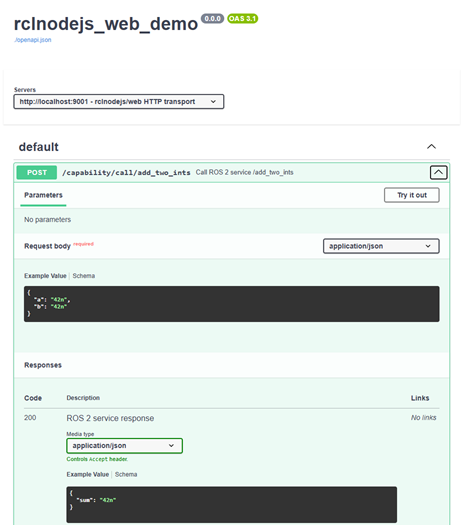

# Zero-build ROS 2 in a single HTML page

A single static HTML page that talks to a real ROS 2 graph — just
`<script type="module">` and the SDK's ESM file. No bundler, no
`npm install` for the page itself.

## Run it (two shells)

```bash
cd demo/web/javascript
```

**Shell 1 — runtime + the demo's ROS 2 nodes:**

```bash
source /opt/ros/<distro>/setup.bash
node runtime.mjs
# rclnodejs/web : ws://localhost:9000/capability
#               also http://localhost:9001/capability  (call/publish/action, curl-able)
#               also http://localhost:9001/capability/subscribe/<name>  (SSE)
```

`runtime.mjs` includes `/add_two_ints`, `/web_demo_chatter`, and a cancellable
`/fibonacci` server (`example_interfaces/action/Fibonacci`).

**Shell 2 — static-file server** (hosts `index.html`, maps `/sdk/*` to
the in-repo [`web/`](../../../web/) SDK):

```bash
node static.mjs
# Static files : http://localhost:8080/
```

For custom ports, set `RUNTIME_PORT`, `HTTP_PORT`, and `STATIC_PORT`;
match the page URL, e.g. `?wsPort=9010&httpPort=9011`.

## What the browser code looks like

```html
<script type="module">
  import { connect } from '/sdk/index.js';
  const ros = await connect('ws://localhost:9000/capability');

  const reply = await ros.call('/add_two_ints', { a: '2n', b: '40n' });
  console.log(reply.sum); // '42n'

  await ros.subscribe('/web_demo_chatter', (msg) => render(msg.data));
  await ros.publish('/web_demo_chatter', { data: 'hi' });
</script>
```

The page also has a **transport toggle** (WebSocket vs. HTTP) so you
can flip the SDK between the two without restarting.

## Fibonacci actions

Send an order from 2 to 12 (default 8) to see feedback every half-second,
then the final sequence and status.

- WebSocket: **Cancel Goal** requests cancellation.
- HTTP/SSE: **Stop Streaming** disconnects without canceling the ROS goal.
- Switching transports or leaving the page closes the client and ignores late events.

```js
const client = await connect({ http: 'http://localhost:9001' });
try {
  const goal = await client.action('/fibonacci', { order: 5 }, {
    onFeedback: (feedback) => console.log(feedback.sequence),
  });
  console.log(await goal.result, goal.status);
} finally {
  await client.close();
}
```

The panel's `{ http }` client uses `fetch()` for SSE actions. Topic
subscriptions remain on WebSocket; `sse: true` is not needed for actions.

## Same capability, no SDK

Every `call` / `publish` / `subscribe` / `action` is also reachable as plain HTTP —
curl, Postman, or an AI agent, no JavaScript required:

```bash
curl -sS -X POST http://localhost:9001/capability/call/add_two_ints \
  -H 'content-type: application/json' -d '{"a":"7n","b":"35n"}'
# => {"sum":"42n"}

curl --fail-with-body -sS -N http://localhost:9001/capability/action/fibonacci \
  -H 'content-type: application/json' -d '{"order":3}'
# terminal data: {"status":"succeeded","payload":{"sequence":[0,1,1,2]}}

curl -N http://localhost:9001/capability/subscribe/web_demo_chatter
# event: message
# data: {"data":"hi from curl"}
```

The demo enables SSE + CORS (`new HttpTransport({ sse: true, cors: true
})`), so the same endpoints also work from a plain browser
`EventSource` / `fetch()` — see the page's own panels 6 and 7 for live,
runnable examples.

> For browser apps, prefer the WebSocket transport for `subscribe` — one
> connection multiplexes every topic. SSE targets the curl / AI-agent /
> server-side persona.

### Pair it with your own publisher

The runtime also exposes `/topic`, so you can feed the demo from any ROS 2
node instead of the in-page publisher:

```bash
source /opt/ros/<distro>/setup.bash
node ../../../example/topics/publisher/publisher-example.mjs

curl -N http://localhost:9001/capability/subscribe/topic
```

## Without the bundled `runtime.mjs`

`runtime.mjs` bundles the runtime and the demo's sample nodes into one
process. In a real project those nodes already run elsewhere, so you
only need the runtime — replace shell 1 with the CLI (shell 2 is
unchanged):

```bash
node ../../../bin/rclnodejs-web.js web.json

# plus the service the demo expects:
ros2 run demo_nodes_cpp add_two_ints_server
```

`web.json` already sets `sse`/`cors`, matching what `runtime.mjs` enables
in code.

For CLI mode, also run a `/fibonacci` server using
`example_interfaces/action/Fibonacci`. Wildcard CORS is for local testing only.

## OpenAPI — no server required

The same `web.json` also documents itself as an OpenAPI 3.1 document — a
one-shot subcommand that prints it and exits, without starting any
transport or calling `rclnodejs.init()`.

The export includes action schemas. Swagger UI may buffer SSE; use the
panel or curl for live feedback.

```bash
source /opt/ros/<distro>/setup.bash
node ../../../bin/rclnodejs-web.js openapi web.json > openapi.json

# Browse it in Swagger UI (loads from a CDN, no install needed):
node static.mjs
# open http://localhost:8080/swagger-ui.html
```


