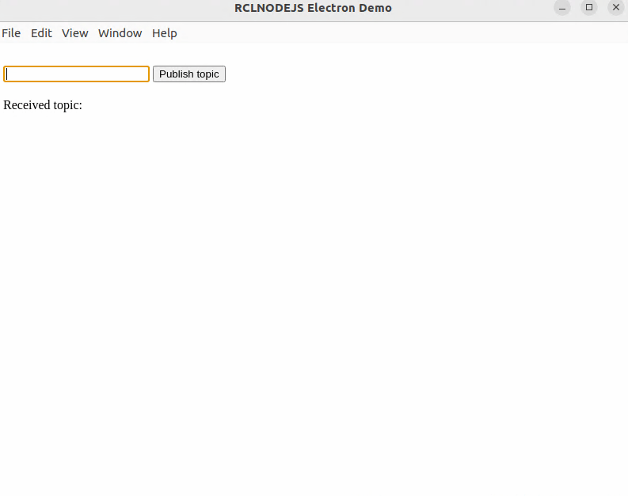

# Topics Demo - Electron and rclnodejs

A minimal Electron application demonstrating basic ROS2 topic communication using rclnodejs. This demo provides a simple interface for publishing and subscribing to string messages, making it the perfect starting point for learning rclnodejs with Electron.



## 📨 Features

- **Simple Publisher**: Text input interface for publishing string messages
- **Real-time Subscriber**: Live display of received messages
- **Message Counter**: Tracks published and received message counts
- **Clean UI**: Minimal, user-friendly interface
- **Educational**: Perfect introduction to ROS2 topics with Electron

### ROS2 Integration

- **Topic**: `ts_demo` (std_msgs/String)
- **Publisher**: Sends user-input text messages
- **Subscriber**: Receives and displays messages in real-time
- **Node Name**: `electron_demo_node`

## 📋 Prerequisites

- **Node.js** (>= 16.13.0) - JavaScript runtime
- **ROS 2** (Humble, Jazzy, or newer) - Robot Operating System 2
- **rclnodejs compatible environment** - Linux recommended (tested on Ubuntu/WSL)

## 🛠️ Installation

1. **Navigate to the demo directory**:

   ```bash
   cd rclnodejs/electron_demo/topics
   ```

2. **Source your ROS 2 environment**:

   ```bash
   source /opt/ros/jazzy/setup.bash  # or your ROS 2 distro
   ```

3. **Install dependencies**:

   ```bash
   npm install
   ```

4. **Rebuild rclnodejs for Electron**:
   ```bash
   ./node_modules/.bin/electron-rebuild
   ```

## 🚀 Running the Demo

Start the application:

```bash
npm start
```

The demo window will open with:

- **Text input field** for typing messages to publish
- **Send button** to publish messages to the `ts_demo` topic
- **Message display area** showing received messages
- **Counters** for published and received messages

## 📁 Project Structure

- **`package.json`** - Project configuration and dependencies
- **`main.js`** - Electron main process with rclnodejs integration
- **`index.html`** - Application interface and layout
- **`renderer.js`** - Renderer process handling UI interactions and ROS2 communication

## 🔗 Related Resources

- [Electron Documentation](https://electronjs.org/docs) - Complete Electron framework guide
- [Native Node Modules](https://www.electronjs.org/docs/latest/tutorial/using-native-node-modules) - Using native modules with Electron
- [rclnodejs Documentation](../../README.md) - Core rclnodejs API reference
