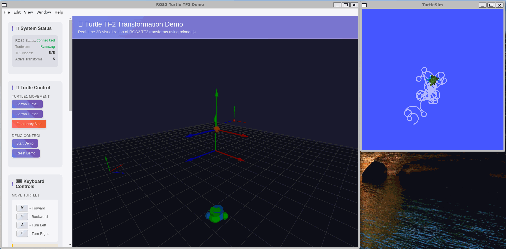

# Turtle TF2 Electron Demo

This demo replicates the functionality of the ROS2 `turtle_tf2_py` package using rclnodejs and provides a modern web-based 3D visualization interface. It demonstrates coordinate frame transformations, turtle simulation, and real-time TF2 data visualization.

## Overview

The turtle_tf2 demo showcases:

- **Transform Broadcasting**: Multiple TF2 broadcasters publishing coordinate frame relationships
- **Transform Listening**: Real-time monitoring and visualization of coordinate transformations
- **Turtle Simulation**: Integration with turtlesim for turtle pose tracking and control
- **Turtle Following**: Intelligent turtle2 behavior that automatically follows turtle1 using TF2 transforms
- **3D Visualization**: WebGL-based rendering using Three.js for immersive coordinate frame visualization
- **Interactive Controls**: Web interface for spawning turtles, controlling motion, and managing transforms



## Features

### TF2 Broadcasters

- **Static Frame Broadcaster**: Publishes fixed coordinate frame relationships
- **Dynamic Frame Broadcaster**: Creates time-varying transforms with circular motion patterns
- **Fixed Frame Broadcaster**: Maintains constant offset transforms
- **Turtle Transform Broadcaster**: Converts turtle poses to TF2 transforms

### Turtle Following System

- **Real-time Following**: turtle2 automatically follows turtle1 using distance and angle calculations
- **Smart Movement**: Proportional velocity control based on distance to target
- **Collision Avoidance**: turtle2 stops when within optimal following distance (0.5 units)
- **Transform Integration**: Following logic uses turtle pose data from TF2 coordinate frames

### Visualization

- **3D Scene**: Interactive Three.js environment with orbit controls
- **Coordinate Frames**: Visual representation of X, Y, Z axes with color coding
- **Turtle Models**: 3D turtle representations with real-time pose updates
- **Transform Monitoring**: Live display of active transforms and their parameters
- **Frame Toggles**: Show/hide specific coordinate frames

### Control Interface

- **Turtle Spawning**: Create turtle2 instance (turtle1 spawns automatically with turtlesim)
- **Motion Control**: WASD keyboard controls for turtle1 movement
- **Demo Management**: Initialize and reset demo state
- **Transform Filtering**: Toggle visibility of different frame types

## Prerequisites

### System Requirements

- **ROS2**: Humble, Iron, or Rolling distribution
- **Node.js**: Version 18 or higher (for compatibility with latest Electron)
- **turtlesim**: ROS2 turtle simulation package
- **Electron**: For desktop application framework

### ROS2 Packages

```bash
# Install required ROS2 packages
sudo apt install ros-$ROS_DISTRO-turtlesim
sudo apt install ros-$ROS_DISTRO-tf2-tools
sudo apt install ros-$ROS_DISTRO-tf2-ros
```

### Node.js Dependencies

The demo uses the following key dependencies:

- `rclnodejs`: ROS2 bindings for Node.js
- `electron`: Cross-platform desktop app framework
- `three`: 3D graphics library for WebGL rendering

## Installation

1. **Navigate to the demo directory**:

   ```bash
   cd electron_demo/turtle_tf2
   ```

2. **Install dependencies**:

   ```bash
   npm install
   ```

3. **Rebuild native modules**:

   ```bash
   npm run rebuild
   ```

   This step is crucial for ensuring that rclnodejs and other native dependencies are properly compiled for your system.

4. **Source ROS2 environment**:

   ```bash
   source /opt/ros/$ROS_DISTRO/setup.bash
   ```

   **Important**: The ROS2 environment must be sourced in the same terminal session where you run `npm start`.

## Running the Demo

**⚠️ Important Setup Note**: Before running the demo, make sure to:

1. Source the ROS2 environment in your terminal: `source /opt/ros/$ROS_DISTRO/setup.bash`
2. Keep this terminal session active for the entire demo run

### Method 1: Complete Demo

Start the full demo with all components (ensure you have run `npm install && npm run rebuild` first):

```bash
# Source ROS2 first
source /opt/ros/$ROS_DISTRO/setup.bash

# Then start the demo
npm start
```

### Method 2: Step-by-Step Launch

1. **Source ROS2 environment**:

   ```bash
   source /opt/ros/$ROS_DISTRO/setup.bash
   ```

2. **Start turtlesim (in separate terminal, also sourced)**:

   ```bash
   source /opt/ros/$ROS_DISTRO/setup.bash
   ros2 run turtlesim turtlesim_node
   ```

3. **Launch the Electron application**:

   ```bash
   npm start
   ```

4. **Use the web interface to**:
   - Click "Start Demo" to initialize all TF2 broadcasters
   - Click "Spawn Turtle2" to create the second turtle (turtle1 spawns automatically)
   - Use WASD keys to control turtle1 movement
   - Watch turtle2 automatically follow turtle1
   - Use frame toggle buttons to show/hide specific transforms

**⚠️ Important**: The dynamic frame (`carrot1_dynamic`) orbits around the static frame (`carrot1_static`) in a circular pattern with a 2-unit radius, regardless of turtle positions.

## 📦 Packaging for Distribution

You can package the application into a standalone folder using **Electron Forge**.

### 1. Build the Package

Run the following command to create a distributable executable:

```bash
npm run package
```

The output will be located in the `out/` directory.

### 2. Create Installers (Optional)

To create a `.zip` file or other platform-specific installers (deb/rpm), run:

```bash
npm run make
```

**Note**: Creating DEB/RPM installers requires system tools like `dpkg` and `fakeroot`. For ZIP files, you need `zip`.

### 3. Running the Standalone Application

Even as a standalone application, **ROS 2 must be installed and sourced on the target machine** because `rclnodejs` links dynamically to the ROS 2 shared libraries.

```bash
# Source ROS2 environment
source /opt/ros/$ROS_DISTRO/setup.bash

# Run the packaged executable
./out/rclnodejs-turtle-tf2-demo-linux-x64/rclnodejs-turtle-tf2-demo
```

## Demo Components

### Main Process (main.js)

- **TF2 Static Broadcaster**: Publishes `world → carrot1_static` transform
- **TF2 Dynamic Broadcaster**: Publishes time-varying `carrot1_static → carrot1_dynamic` transform
- **Fixed Frame Broadcaster**: Publishes constant offset `turtle1 → carrot1_fixed` transform
- **Turtle TF2 Broadcaster**: Converts turtle poses to `world → turtle1/turtle2` transforms
- **Turtle TF2 Listener**: Monitors turtle poses and controls turtle2 following behavior using real-time transform data

### Renderer Process (renderer.js)

- **3D Scene Management**: Three.js scene setup with lighting and camera controls
- **Coordinate Frame Visualization**: Colored axes representation (X=red, Y=green, Z=blue)
- **Turtle Rendering**: 3D turtle models with real-time pose updates
- **Following Logic**: Calculates distance, angle, and velocity commands for turtle2 following behavior
- **Transform Monitoring**: Live display of transform data and frame relationships
- **User Interaction**: Control buttons, keyboard handling, and visual feedback systems

### HTML Interface (index.html)

- **Control Panel**: Buttons for turtle spawning and demo management
- **Status Display**: Real-time connection and system status
- **Transform List**: Active transforms with position and rotation data
- **3D Viewport**: WebGL canvas for Three.js rendering

## Understanding TF2 Concepts

### Coordinate Frames

- **world**: Global reference frame (origin)
- **turtle1/turtle2**: Turtle body frames following turtlesim poses
- **carrot1_static**: Static frame with fixed relationship to world
- **carrot1_dynamic**: Dynamic frame with circular motion around carrot1_static (2-unit radius)
- **carrot1_fixed**: Fixed offset frame relative to turtle1

### Transform Chain

The demo creates the following transform chain:

```
world → carrot1_static → carrot1_dynamic
world → turtle1 → carrot1_fixed
world → turtle2
```

### Real-time Visualization

- Coordinate frames are rendered as colored axes (X=red, Y=green, Z=blue)
- Transforms update in real-time as turtles move and frames change
- The transform list shows current position and rotation values
- Interactive 3D camera allows inspection from different angles

## Controls

### Keyboard Controls (NEW!)

**Turtle1 Movement**:

- **W**: Move forward
- **S**: Move backward
- **A**: Turn left
- **D**: Turn right

💡 **Tip**: Click on the 3D visualization area first to ensure keyboard focus, then use WASD keys to drive turtle1 around the turtlesim environment. turtle2 will automatically follow turtle1!

**Camera Controls**:

- **Arrow Keys**: Move camera view
- **Mouse Drag**: Rotate camera around scene
- **Mouse Wheel**: Zoom in/out
- **Right Click + Drag**: Pan camera view

**Note**: Arrow keys are reserved for 3D camera navigation. Use WASD keys exclusively for turtle control to avoid conflicts.

### Turtle Management

- **Spawn Turtle2**: Creates turtle2 at position (4.0, 2.0) - turtle1 is automatically spawned by turtlesim
- **Stop All**: Halts all turtle motion commands

### Turtle Following Behavior

Once turtle2 is spawned, it will automatically follow turtle1 with the following intelligent behaviors:

- **Distance-based Speed**: turtle2 moves faster when far from turtle1, slower when close
- **Angle Correction**: turtle2 continuously adjusts its heading to face turtle1
- **Smart Stopping**: turtle2 stops moving when within 0.5 units of turtle1 to avoid collision
- **Real-time Updates**: Following commands are sent every second based on current turtle positions

**Following Algorithm Details**:

- **Linear Velocity**: Proportional to distance (max speed: 2.0 units/sec)
- **Angular Velocity**: Proportional to angle difference (4.0 × angle error)
- **Minimum Following Distance**: 0.5 units (prevents excessive oscillation)

You can observe the following behavior by:

1. Spawning turtle2 using the "Spawn Turtle2" button
2. Using WASD keys to move turtle1 around
3. Watching turtle2 chase turtle1 in both the turtlesim window and 3D visualization

### Demo Control

- **Start Demo**: Initializes all TF2 broadcasters and systems
- **Reset Demo**: Clears all turtles and transforms, resets to initial state

### Frame Visibility

- **Toggle Static**: Show/hide carrot1_static frame (red sphere, fixed position)
- **Toggle Dynamic**: Show/hide carrot1_dynamic frame (orange sphere, orbits around carrot1_static)
- **Toggle Fixed**: Show/hide carrot1_fixed frame (purple sphere, fixed offset from turtle1)

**Visual Guide**:

- **Static Frame**: Red sphere at fixed world coordinates (2.0, 3.0, 0.0)
- **Dynamic Frame**: Orange sphere that moves in a circular pattern around the static frame (2-unit radius)
- **Fixed Frame**: Purple sphere that maintains a constant offset relative to turtle1
- **Turtle Frames**: Coordinate axes (X=red, Y=green, Z=blue) attached to each turtle

### 3D Navigation

- **Mouse Drag**: Rotate camera around scene
- **Mouse Wheel**: Zoom in/out
- **Right Click + Drag**: Pan camera view

## Troubleshooting

### Common Issues

1. **"Cannot connect to ROS2" or "librcl.so: cannot open shared object file"**

   - Ensure ROS2 is sourced: `source /opt/ros/$ROS_DISTRO/setup.bash`
   - **Critical**: Source ROS2 in the SAME terminal where you run `npm start`
   - Check if ROS2 daemon is running: `ros2 daemon status`
   - Verify ROS2 installation: `ros2 --version`

2. **"Turtlesim not responding" or "Failed to spawn turtle2"**

   - Verify turtlesim is running: `ros2 run turtlesim turtlesim_node`
   - Check available topics: `ros2 topic list`
   - Ensure spawn service is available: `ros2 service list | grep spawn`
   - Try restarting turtlesim_node if spawn calls fail

3. **"No transforms detected"**

   - Ensure demo is started: Click "Start Demo" button
   - Check TF2 tree: `ros2 run tf2_tools view_frames`

4. **"Dynamic frame not visible when toggling"**

   - **Check if the demo is started**: Click "Start Demo" button first to initialize all broadcasters
   - **Look for an orange sphere near coordinates (2,3)**: The dynamic frame appears as an orange sphere orbiting around the red static frame
   - **Wait for circular motion**: The dynamic frame moves in a 2-unit radius circle, taking about 6 seconds for a full rotation
   - **The orange sphere is now bigger**: The dynamic frame has been made 3x larger for better visibility
   - **Check the transform list**: The dynamic frame should appear in the left panel's transform list with changing coordinates around (2±2, 3±2, 0)

5. **"3D visualization not loading"**

   - Check browser console for WebGL errors
   - Ensure hardware acceleration is enabled
   - Try restarting the Electron application

6. **"electron: not found" or native module errors**

   - Make sure you ran `npm run rebuild` after `npm install`
   - Ensure Node.js version is compatible (18 or higher)
   - Try deleting `node_modules` and running `npm install && npm run rebuild` again

7. **"THREE is not defined" or script loading errors**

   - Ensure Three.js is properly installed: `npm install three@0.155.0`
   - Check that `node_modules/three/build/three.min.js` exists
   - If issues persist, try reinstalling: `rm -rf node_modules && npm install && npm run rebuild`

8. **WSL (Windows Subsystem for Linux) specific issues**
   - Install audio libraries: `sudo apt install libasound2t64 libasound2-dev`
   - Enable X11 forwarding for GUI: Install VcXsrv or similar X server
   - Some GUI features may be limited in WSL environment

### Debugging Commands

```bash
# Check TF2 transforms
ros2 run tf2_tools view_frames

# Monitor TF2 topic
ros2 topic echo /tf

# List active nodes
ros2 node list

# Check turtle poses
ros2 topic echo /turtle1/pose
```

## Development

### Project Structure

```
turtle_tf2/
├── package.json          # Node.js dependencies and scripts
├── main.js               # Electron main process with ROS2 nodes
├── renderer.js           # Three.js renderer and UI logic
├── index.html            # Web interface and controls
└── README.md             # This documentation
```

### Key Technologies

- **rclnodejs**: Provides ROS2 integration for Node.js
- **Electron**: Enables desktop application with web technologies
- **Three.js**: Handles 3D graphics and WebGL rendering
- **TF2**: ROS2 transform library for coordinate frame management

### Extending the Demo

- Add custom coordinate frames by modifying broadcaster nodes
- Implement additional turtle behaviors in the listener logic
- Enhance 3D visualization with trails, grids, or measurement tools
- Create custom transform visualizations for specific use cases

## Related Resources

- [ROS2 TF2 Tutorials](https://docs.ros.org/en/humble/Tutorials/Intermediate/Tf2/Tf2-Main.html)
- [turtle_tf2_py Source](https://github.com/ros/geometry_tutorials/tree/ros2/turtle_tf2_py)
- [Three.js Documentation](https://threejs.org/docs/)
- [rclnodejs GitHub](https://github.com/RobotWebTools/rclnodejs)

## License

Licensed under the Apache License, Version 2.0. See the original rclnodejs LICENSE file for details.
