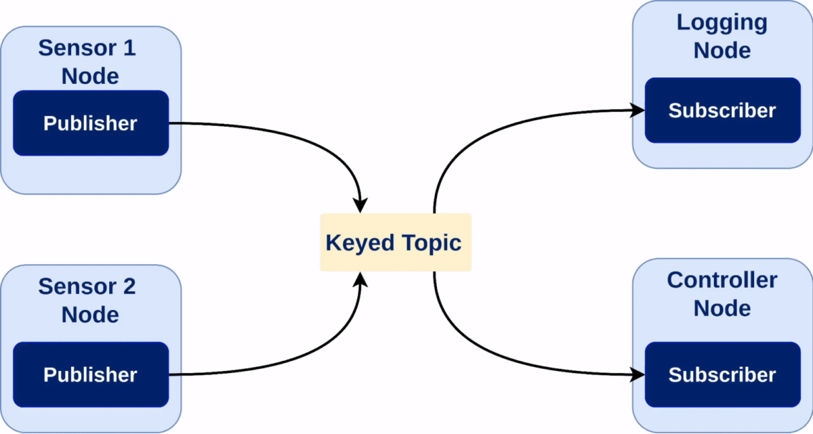

# Content Filtering Subscription in rclnodejs

Content filtering allows subscribers to filter messages at the DDS middleware level, reducing network traffic and computational overhead by evaluating SQL-like expressions before messages reach your callback.

## Table of Contents

- [Requirements and Compatibility](#requirements-and-compatibility)
- [Basic Usage](#basic-usage)
- [Examples](#examples)
- [Dynamic Filter Management](#dynamic-filter-management)
- [Troubleshooting](#troubleshooting)

## What is Content Filtering?

Content filtering enables **server-side message filtering** at the DDS middleware level:

- **Reduces network bandwidth** by filtering messages before transmission
- **Improves performance** by processing only relevant messages
- **Uses SQL-like expressions** to evaluate message fields
- **Supports dynamic updates** to filter parameters at runtime

The DDS middleware evaluates filter expressions for each published message and only delivers matching messages to subscribers, saving CPU cycles and network resources.

### Visual Example: Content Filtering in Action

The following animation illustrates how content filtering works with multiple publishers and a filtered subscriber:



_This example shows sensors publishing data, with the controller (subscriber) only receiving messages that match the filter criteria. Note how unfiltered messages are dropped at the DDS level before reaching the subscriber._

## Requirements and Compatibility

Content filtering requires:

- **ROS 2 Humble** or newer
- **Compatible RMW implementations**:
  - ✅ FastDDS, RTI Connext DDS, GuruM DDS
  - ❌ CycloneDDS, Zenoh (not supported)

```javascript
const rclnodejs = require('rclnodejs');

// Check compatibility
function isContentFilteringSupported() {
  return (
    rclnodejs.DistroUtils.getDistroId() >=
      rclnodejs.DistroUtils.getDistroId('humble') &&
    rclnodejs.RMWUtils.getRMWName() != rclnodejs.RMWUtils.RMWNames.CYCLONEDDS
  );
}
```

## Basic Usage

### Filter Expression Syntax

Content filtering uses SQL-like expressions:

```javascript
// Basic operators: =, <>, !=, <, <=, >, >=, AND, OR, NOT, LIKE, BETWEEN
'data > 10'; // Simple comparison
'data >= %0 AND data <= %1'; // Parameterized with %0, %1 placeholders
"frame_id = 'base_link'"; // String comparison
'position.x > 1.0'; // Nested field access
'poses[0].position.x > %0'; // Array element access
```

### Creating a Filtered Subscription

```javascript
const rclnodejs = require('rclnodejs');

async function createFilteredSubscription() {
  await rclnodejs.init();
  const node = new rclnodejs.Node('filtered_subscriber');

  // Create subscription with content filter
  const options = rclnodejs.Node.getDefaultOptions();
  options.contentFilter = {
    expression: 'data > 10', // Only accept messages where data > 10
    parameters: [],
  };

  const subscription = node.createSubscription(
    'std_msgs/msg/Int32',
    'number_topic',
    options,
    (msg) => {
      console.log(`Received filtered message: ${msg.data}`);
    }
  );

  // Check if filtering is active
  if (subscription.hasContentFilter()) {
    console.log('✅ Content filtering is active');
  }

  node.spin();
}
```

### Parameters for Dynamic Filtering

Parameters make filters reusable and dynamic:

```javascript
// Filter with parameters
const options = rclnodejs.Node.getDefaultOptions();
options.contentFilter = {
  expression: 'data >= %0 AND data <= %1',
  parameters: [10, 50], // Accept values between 10 and 50
};

// String parameters (include quotes)
options.contentFilter = {
  expression: 'frame_id = %0',
  parameters: ["'base_link'"], // Note the quotes in the parameter
};
```

## Troubleshooting

**Filter Not Working:**

- Check RMW compatibility (CycloneDDS not supported)
- Verify parameter syntax (strings need quotes: `"'value'"`)
- Test with simple expressions first

**Common Mistakes:**

```javascript
// ❌ Wrong - JavaScript comparison operator
{ expression: "data !== 0", parameters: [] }

// ✅ Correct - SQL comparison operator
{ expression: "data != 0", parameters: [] }

// ❌ Wrong - numeric comparison for strings
{ expression: "status = %0", parameters: ["active"] }

// ✅ Correct - string comparison with quotes in parameter
{ expression: "status = %0", parameters: ["'active'"] }
```

## RMW Compatibility

| RMW Implementation              | Support Status   |
| ------------------------------- | ---------------- |
| FastDDS (rmw_fastrtps_cpp)      | ✅ Supported     |
| Connext (rmw_connextdds)        | ✅ Supported     |
| GuruM DDS (rmw_gurumdds_cpp)    | ✅ Supported     |
| CycloneDDS (rmw_cyclonedds_cpp) | ❌ Not supported |
| Zenoh (rmw_zenoh_cpp)           | ❌ Not supported |

Check compatibility at runtime:

```javascript
const isSupported =
  rclnodejs.DistroUtils.getDistroId() >=
    rclnodejs.DistroUtils.getDistroId('humble') &&
  rclnodejs.RMWUtils.getRMWName() != rclnodejs.RMWUtils.RMWNames.CYCLONEDDS;
```

## References

- [ROS 2 Content Filtering Documentation](https://docs.ros.org/en/kilted/Tutorials/Demos/Content-Filtering-Subscription.html)
- [Advanced Topic Keys Tutorial](https://docs.ros.org/en/kilted/Tutorials/Advanced/Topic-Keys/Filtered-Topic-Keys-Tutorial.html)
- [rclnodejs GitHub Repository](https://github.com/RobotWebTools/rclnodejs)

---

_This tutorial is part of the rclnodejs documentation. For more tutorials and examples, visit the [rclnodejs GitHub repository](https://github.com/RobotWebTools/rclnodejs)._

## Examples

### Example 1: Temperature Monitoring

Monitor sensor data and only receive critical temperature alerts:

```javascript
const rclnodejs = require('rclnodejs');

async function temperatureMonitor() {
  await rclnodejs.init();
  const node = new rclnodejs.Node('temperature_monitor');

  const options = rclnodejs.Node.getDefaultOptions();
  options.contentFilter = {
    expression: 'temperature > %0',
    parameters: [80.0], // Critical temperature threshold
  };

  const subscription = node.createSubscription(
    'sensor_msgs/msg/Temperature',
    'temperature_data',
    options,
    (msg) => {
      console.log(`� ALERT: Critical temperature: ${msg.temperature}°C`);
    }
  );

  console.log('🌡️ Monitoring critical temperatures > 80°C');
  node.spin();
}
```

### Example 2: Robot Motion Filtering

Filter robot movement commands for specific conditions:

```javascript
const rclnodejs = require('rclnodejs');

async function motionFilter() {
  await rclnodejs.init();
  const node = new rclnodejs.Node('motion_filter');

  const options = rclnodejs.Node.getDefaultOptions();
  options.contentFilter = {
    expression: 'linear.x > %0 OR ABS(angular.z) > %1',
    parameters: [0.1, 0.2], // Significant linear or angular motion
  };

  const subscription = node.createSubscription(
    'geometry_msgs/msg/Twist',
    'cmd_vel',
    options,
    (msg) => {
      console.log(
        `Motion: linear=${msg.linear.x.toFixed(2)}, angular=${msg.angular.z.toFixed(2)}`
      );
    }
  );

  node.spin();
}
```

### Example 3: Multi-Sensor Data Processing

Filter data from multiple sensors with complex criteria:

```javascript
const rclnodejs = require('rclnodejs');

class SensorDataProcessor {
  constructor() {
    this.node = null;
    this.messageCount = 0;
  }

  async start() {
    await rclnodejs.init();
    this.node = new rclnodejs.Node('sensor_processor');

    // Filter for valid sensor readings in operating range
    const options = rclnodejs.Node.getDefaultOptions();
    options.contentFilter = {
      expression: 'range >= %0 AND range <= %1 AND field_of_view > %2',
      parameters: [0.1, 5.0, 0.1], // Valid range and FOV
    };

    this.subscription = this.node.createSubscription(
      'sensor_msgs/msg/Range',
      'sensor_data',
      options,
      (msg) => this.processSensorData(msg)
    );

    this.node.spin();
  }

  processSensorData(msg) {
    console.log(
      `[${++this.messageCount}] Valid reading: ${msg.range.toFixed(3)}m`
    );
  }

  // Update filter for different operating modes
  updateRange(minRange, maxRange) {
    const newFilter = {
      expression: 'range >= %0 AND range <= %1 AND field_of_view > 0.1',
      parameters: [minRange, maxRange],
    };

    if (this.subscription.setContentFilter(newFilter)) {
      console.log(`📝 Updated range: [${minRange}, ${maxRange}]`);
    }
  }
}
```

## Dynamic Filter Management

You can modify content filters at runtime:

### Updating Filters

```javascript
const rclnodejs = require('rclnodejs');

class AdaptiveFilter {
  constructor() {
    this.node = null;
    this.subscription = null;
    this.threshold = 10;
  }

  async start() {
    await rclnodejs.init();
    this.node = new rclnodejs.Node('adaptive_filter');

    const options = rclnodejs.Node.getDefaultOptions();
    options.contentFilter = {
      expression: 'data > %0',
      parameters: [this.threshold],
    };

    this.subscription = this.node.createSubscription(
      'std_msgs/msg/Int32',
      'sensor_data',
      options,
      (msg) => {
        console.log(`Received: ${msg.data} (threshold: ${this.threshold})`);
      }
    );

    // Update filter every 5 seconds
    setInterval(() => this.updateThreshold(), 5000);
    this.node.spin();
  }

  updateThreshold() {
    this.threshold += 5;

    const newFilter = {
      expression: 'data > %0',
      parameters: [this.threshold],
    };

    if (this.subscription.setContentFilter(newFilter)) {
      console.log(`📝 Updated threshold to: ${this.threshold}`);
    }
  }

  // Clear filter to receive all messages
  clearFilter() {
    if (this.subscription.clearContentFilter()) {
      console.log('🗑️ Filter cleared - receiving all messages');
    }
  }
}
```

### Filter Management Methods

```javascript
// Check if content filtering is active
if (subscription.hasContentFilter()) {
  console.log('Content filtering is enabled');
}

// Update filter
subscription.setContentFilter({
  expression: 'data BETWEEN %0 AND %1',
  parameters: [10, 100],
});

// Clear filter (alternative ways)
subscription.clearContentFilter(); // Recommended
subscription.setContentFilter(); // Also works
subscription.setContentFilter(undefined); // Also works
```

## Troubleshooting

### Common Issues and Solutions

**Content Filter Not Applied**: `hasContentFilter()` returns `false`

```javascript
// Check RMW compatibility
console.log('RMW:', rclnodejs.RMWUtils.getRMWName());
if (rclnodejs.RMWUtils.getRMWName() == rclnodejs.RMWUtils.RMWNames.CYCLONEDDS) {
  console.log('❌ CycloneDDS does not support content filtering');
}

// Check ROS 2 version
if (
  rclnodejs.DistroUtils.getDistroId() <
  rclnodejs.DistroUtils.getDistroId('humble')
) {
  console.log('❌ Content filtering requires ROS 2 Humble or newer');
}
```

**Invalid Filter Expression**: Filter causes errors

```javascript
// ✅ Valid field references
'data = 5'; // std_msgs/msg/Int32
'position.x > 1.0'; // geometry_msgs/msg/Point
"header.frame_id = 'base'"; // Any message with header

// ❌ Common mistakes
'invalid_field > 0'; // Field doesn't exist
'data > invalid_value'; // Invalid value syntax
'data >'; // Incomplete expression
```

**Parameter Count Mismatch**: Parameters don't match placeholders

```javascript
// ❌ Wrong: 2 placeholders, 1 parameter
{ expression: "data > %0 AND data < %1", parameters: [10] }

// ✅ Correct: 2 placeholders, 2 parameters
{ expression: "data > %0 AND data < %1", parameters: [10, 50] }
```

**Performance Issues**: Complex expressions slow down filtering

```javascript
// ❌ Avoid complex calculations
'SQRT(x*x + y*y) > 5.0';

// ✅ Use simpler conditions
'distance > 5.0'; // Pre-calculate in message
'x > 5.0 OR y > 5.0'; // Approximate with simpler logic
```

### Debugging Tools

```javascript
// Check compatibility
const isSupported =
  rclnodejs.DistroUtils.getDistroId() >=
    rclnodejs.DistroUtils.getDistroId('humble') &&
  rclnodejs.RMWUtils.getRMWName() != rclnodejs.RMWUtils.RMWNames.CYCLONEDDS;

// Validate filter syntax
function validateFilter(expression, parameters = []) {
  const placeholderCount = (expression.match(/%\d+/g) || []).length;
  return placeholderCount === parameters.length;
}
```

## Best Practices & Tips

- **Keep filters simple** for best performance and reliability
- **Use parameters** for dynamic and reusable filter expressions
- **Handle errors gracefully** with fallback to unfiltered subscriptions
- **Test compatibility** before deploying in production
- **Monitor effectiveness** to ensure filters work as expected

### When to Use Content Filtering

✅ **Use for:**

- High-frequency topics where you only need subset of messages
- Resource-constrained systems requiring network/CPU efficiency
- Event-driven applications reacting to specific conditions

❌ **Don't use for:**

- Simple applications needing all messages
- RMW environments without support (CycloneDDS, Zenoh)
- Complex calculations better done in application code

---

## Conclusion

Content filtering in rclnodejs provides powerful message filtering at the DDS middleware level, improving performance by reducing network traffic and computational overhead. Key benefits include:

- **Network efficiency**: Only matching messages transmitted
- **Performance gains**: Callbacks process only relevant messages
- **Dynamic adaptation**: Runtime filter updates for changing conditions
- **Scalability**: Better performance with high-frequency data

**Quick reference:**

- Requires ROS 2 Humble+ with compatible RMW (not CycloneDDS)
- Use `options.contentFilter` with SQL-like expressions
- Manage with `hasContentFilter()`, `setContentFilter()`, `clearContentFilter()`
- Test thoroughly and provide fallbacks for unsupported environments

For more information:

- [ROS 2 Content Filtering Demo](https://docs.ros.org/en/kilted/Tutorials/Demos/Content-Filtering-Subscription.html)
- [rclnodejs API Documentation](https://robotwebtools.github.io/rclnodejs/)
- [Content filtering tests](../test/test-subscription-content-filter.js)
- [DDS 1.4 Specification](https://www.omg.org/spec/DDS/1.4/PDF) (Annex B for filter syntax)
